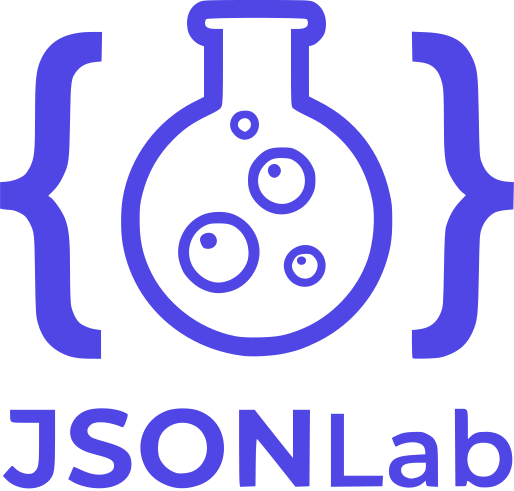

# JSONLab

 



**JSONLab** is a modern, feature-rich web-based JSON editor designed for developers who work with JSON.

It provides a editing experience with powerful tools for viewing, editing, formatting, validating, repairing, querying, and comparing JSON.

**JSONLab** is intentionally built with **zero frameworks** using **100% Vanilla JavaScript, CSS, and HTML5**. 

### [🔗 View Live Demo](https://danivek.github.io/JSONLab/)

## 📚 Table of Contents

- [JSONLab](#jsonlab)
  - [📚 Table of Contents](#-table-of-contents)
  - [✨ Key Features](#-key-features)
  - [📖 Usage Guide](#-usage-guide)
    - [Editing JSON](#editing-json)
    - [Formatting \& Validating](#formatting--validating)
    - [Working with Two Panels](#working-with-two-panels)
    - [Comparing JSON](#comparing-json)
    - [Querying JSON](#querying-json)
    - [Importing Files](#importing-files)
    - [Exporting](#exporting)
  - [⌨️ Keyboard Shortcuts](#️-keyboard-shortcuts)
  - [🚀 Getting Started (Developer)](#-getting-started-developer)
    - [Development](#development)
    - [Production Build](#production-build)
  - [📜 Credits](#-credits)
  - [🤝 Contributing](#-contributing)
    - [Core Contribution Rule: Keep It Vanilla](#core-contribution-rule-keep-it-vanilla)

## ✨ Key Features

-   **Monaco Editor**: Powered by Monaco (the engine behind VS Code).
-   **Multiple Views**: Text, Tree, Table
-   **Multiple Layout**: View, edit, compare, query
-   **Formatting & Validating**

## 📖 Usage Guide

### Editing JSON

Open the app and start typing JSON directly in the editor. The Monaco editor provides real-time syntax highlighting and error indicators. Use the editor toolbar to switch between **Text**, **Tree**, and **Table** views.

### Formatting & Validating

- Click **Format** to prettify your JSON.
- Click **Compact** to minify it.
- Click **Validate** to check for syntax errors. Errors are shown inline with the line number.
- Click **Repair** to automatically fix common issues like trailing commas or single-quoted strings.

### Working with Two Panels

Switch to **Split Mode** from the header. Use the **→** button on the left panel to copy content to the right, or the **←** button on the right panel to copy left. Drag the center splitter to resize the panels.

### Comparing JSON

Switch to **Compare Mode**. The left and right editor contents are loaded into a Monaco Diff Editor. A change summary panel below the diff view lists all additions, deletions, and modifications.

### JSON Schema

Switch to **JSON Schema Mode**. The left editor contains your main JSON payload, and the right editor contains the JSON Schema.

- **Validate:** The payload is validated against the schema in real-time, with errors shown in a dedicated panel below.
- **Generate:** Click **Generate Schema** to automatically build a valid JSON Schema based on your current JSON payload.

### Querying JSON

Switch to **Query Mode**. The current active editor content is loaded into the input panel. Choose your query engine ([JMESPath](https://jmespath.org/), [JSONPath Plus](https://github.com/JSONPath-Plus/JSONPath), or [JSONQuery](https://github.com/jsonquerylang/jsonquery)) and type your expression — results update automatically as you type, and the transformation is applied to the main editor live.

### Importing Files

Each editor panel has its own **Import** button. You can load:
- `.json` files — loaded and auto-formatted.
- `.csv` files — a dialog prompts for the delimiter, then converts to a JSON array.
- Remote JSON via the **URL** button.

### Exporting

Click **Export** in the editor toolbar to download the current content as `data.json`.

## ⌨️ Keyboard Shortcuts

| Shortcut | Action |
|---|---|
| `Ctrl/Cmd + Shift + F` | Format JSON |
| `Ctrl/Cmd + D` | Toggle dark/light theme |
| `Ctrl/Cmd + Z` | Undo |
| `Ctrl/Cmd + Shift + Z` or `Ctrl/Cmd + Y` | Redo |

Standard Monaco editor shortcuts (find, replace, multi-cursor, etc.) are also available in Text mode.

## 🚀 Getting Started (Developer)

### Development

Install dependencies and start the local development server:

```bash
npm install
npm run dev
```

### Production Build

Generate an optimized production build in the `dist/` folder:

```bash
npm run build
```

You can preview the production build locally:

```bash
npm run preview
```

## 📜 Credits

-   **Editor**: [Monaco Editor](https://microsoft.github.io/monaco-editor/)
-   **Icons**: [Lucide](https://lucide.dev/)
-   **JSON Repair**: [jsonrepair](https://github.com/josdejong/jsonrepair)
-   **JMESPath**: [jmespath](https://github.com/jmespath/jmespath.js)
-   **JSONPath Plus**: [jsonpath-plus](https://github.com/JSONPath-Plus/JSONPath)
-   **JSONQuery**: [jsonquerylang](https://github.com/jsonquerylang/jsonquery)

## 🤝 Contributing

1. Fork the repository and create a feature branch.
2. Make your changes and ensure `npm run lint` passes with no errors.
3. Run `npm run build` to verify the production build succeeds.
4. Open a pull request with a clear description of your changes.

### Core Contribution Rule: Keep It Vanilla

**Do not introduce frontend frameworks or runtime npm dependencies.** JSONLab's architecture is intentionally framework-free. New features should follow the same patterns already established in the codebase:

- New UI components → plain JavaScript class or object literal that creates its own DOM nodes.
- New operations → pure functions added to the relevant `utils/` module.
- New editor behaviors → methods on `JsonEditor` or the appropriate `editor/` module.
- Styling → CSS variables and rules in `styles.css`, not inline styles or a utility framework.

If a feature genuinely cannot be built without a library, open a discussion issue first before adding any dependency.

For code style, the project uses Prettier with automatic import organization — running `npm run lint:fix` will format your code to match the project conventions.
